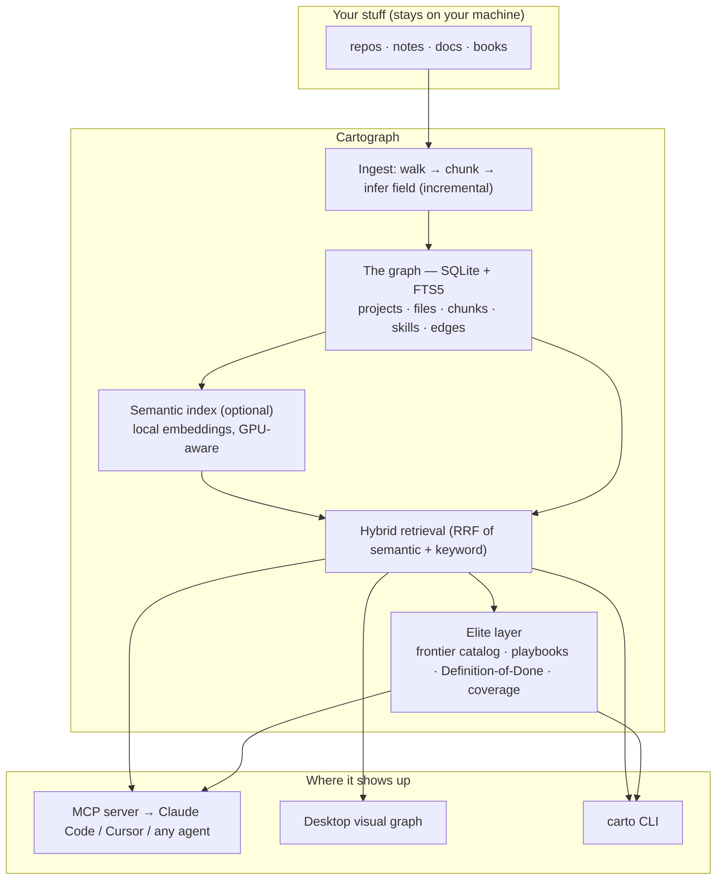
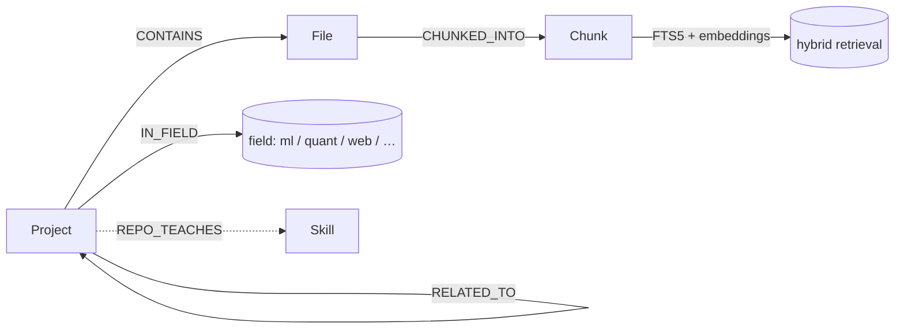

<div align="center">

# 🗺️ Cartograph

**Build a personal cognitive graph of everything you work with — and plug it into your AI agents.**

*Point it at your folders. It maps your repos, notes, and docs into one searchable graph, learns your
field, and serves the right context to Claude Code, Cursor, or any MCP agent — so every future
task, from coding to daily generative-AI use, is grounded in **your** knowledge.*

Local-first · your data never leaves your machine · works on any field · no ML expertise required

[Quickstart](#-quickstart) · [How it works](#-how-it-works) · [Connect your agents](#-connect-your-agents)
· [Requirements](#-requirements) · [Install tiers](#-install-tiers--graph-sizes) · [Visual app](#-the-visual-app)

</div>

---

## ✨ Why

LLM agents are brilliant but amnesiac — they don't know your repos, your conventions, your past
decisions, or what "good" looks like in your field. Cartograph fixes that locally:

1. **Plug** — `pip install cartograph__v1`
2. **Ingest** — `carto ingest ~/code` builds a graph of your work (incrementally, any folder)
3. **(Optional) Train** — add semantic search / your own models on *your* graph
4. **Auto-applied** — your agents query the graph over MCP for grounded context, forever

No cloud. No account. Your graph is a single SQLite file you own.

---

## 🚀 Quickstart

```bash
pip install cartograph__v1            # PyPI package name; the command is `carto`, the import is `cartograph`
carto demo                        # ⚡ see it ALL work in ~10s on a synthetic corpus (zero setup)
carto init                        # pick folder(s) + your field(s) — declaring your field makes labels accurate
carto ingest                      # build your graph (re-run anytime; only changed files reprocess)
carto viz                         # 👀 see your graph in the browser
carto retrieve "how did I handle auth" --chunks   # hybrid search over everything you've done
```

Want semantic (meaning-based) search too?
```bash
pip install "cartograph__v1[semantic]"   # ~2GB; uses your GPU if present, else CPU
carto index                          # embed your chunks once
```

---

## 🧠 How it works



**The graph schema** — everything you work with becomes connected nodes:



**Hybrid retrieval is the headline.** It fuses meaning-based (semantic) and exact (keyword) search via
Reciprocal Rank Fusion. In the engine Cartograph distills from, hybrid scored **success@10 0.986 vs
0.958** for either method alone — it's *never worse*, because it catches both paraphrases (semantic)
and exact tokens like a function name (keyword). It works in pure-keyword mode with zero ML installed,
and turns on semantic automatically once you run `carto index`.

**The elite layer** pulls any build toward the top of its field (works for ML, quant, web, HPC, data,
devops, mobile, game-dev, research, libraries — and is one file to extend):
- `carto elevate "<task>"` — the elite bar, reference repos, the frontier *playbook* (process), and the
  repos you already have to build on
- `carto frontier` — how much of your field's top-tier reference set you've ingested + what to add
- `carto review <project> --field <f>` — grade a build against the field's Definition-of-Done

### 🧭 The persona layer — steer your agents *to you*

The graph knows your work; the **persona layer** learns *what you respond to* and shapes every answer.
It models you as field weights + an optional preference vector in embedding space, re-ranks retrieval by
alignment to you, and emits a model-agnostic **steering brief** any agent prepends — so Claude / Cursor /
ChatGPT / Gemini outputs adapt to your field, conventions, and preferences, and **keep adapting** as you
give feedback. Confidence-scaled: well-supported preferences steer hard, sparse ones barely nudge.

```bash
carto persona                         # your learned focus + confidence
carto personalize "how do I cache this?"   # the steering brief an agent prepends
carto feedback --liked my-repo        # teach it what was useful (adapts over time)
```
The same brief is available to agents via the MCP `personalize` tool and to web GenAI via
`carto serve` + a tiny userscript ([docs/BROWSER.md](docs/BROWSER.md)). Foundations, the
Hilbert-space mapping, and honest limits: **[docs/PERSONA.md](docs/PERSONA.md)**.

---

## 🔌 Connect your agents

Cartograph speaks **MCP** (Model Context Protocol). Add it once and your agent can query your graph.

**One-step wiring:** run `carto agent-setup` — it prints the MCP config *and* a system-prompt rule that
makes your agent call Cartograph automatically each task (`personalize` → `retrieve_context` → `record_use`).

**Claude Code / Cursor** — add to your MCP config (`~/.cursor/mcp.json` or Claude Code's MCP settings):
```json
{
  "mcpServers": {
    "cartograph": { "command": "carto", "args": ["mcp-server"], "type": "stdio" }
  }
}
```

Your agent now has these tools:
| Tool | What it gives the agent |
|---|---|
| **`personalize`** | **call first** — a steering brief (your persona, field, output guidance + your relevant snippets) so the answer fits *you* and adapts over time |
| `retrieve_context` | the relevant code/doc **snippets** to inject (hybrid) |
| `relevant_projects` | which of your repos relate to the task |
| `elevate_task` | top-of-field briefing: bar + reference repos + playbook |
| `frontier_status` | your coverage of each field's best references |
| `record_use` | after answering, report what helped → the persona adapts automatically |
| `graph_stats` | size of your graph |

> Tip: tell your agent in its system prompt *"At the start of a task, call `elevate_task` and
> `retrieve_context` against Cartograph."* — then every future task is grounded in your knowledge.

---

## 💻 Requirements

| | Minimum | Recommended |
|---|---|---|
| Python | 3.10+ | 3.12 |
| OS | Windows / macOS / Linux | any |
| RAM | 4 GB | 16 GB+ |
| Disk | ~50 MB + your data | put the graph on a fast/large drive (`CARTOGRAPH_HOME`) |
| GPU | none (CPU works) | any CUDA GPU → ~10× faster embedding |
| Heavy ML | **not required** | `cartograph__v1[semantic]` for meaning-based search |

**Efficiency tips**
- Put your workspace on a fast, roomy drive: `export CARTOGRAPH_HOME=/mnt/fast/cartograph`.
- A CUDA GPU makes `carto index` dramatically faster; CPU still works (just slower).
- `carto ingest` is incremental — re-run it anytime; only changed files reprocess.
- Brute-force semantic search is fine to a few million chunks (~150 ms/query). Past that, see
  [docs/SCALING.md](docs/SCALING.md) to swap in FAISS.

---

## 📦 Install tiers & graph sizes

Cartograph is **modular** — install only what you need, and grow the graph to any size:

| Install | Command | Adds |
|---|---|---|
| **Core** | `pip install cartograph__v1` | full graph + keyword search + viz + Studio + MCP. Tiny, instant. |
| **Semantic** | `pip install "cartograph__v1[semantic]"` | meaning-based + hybrid search; the learned models (~2 GB) |
| **ML** | `pip install "cartograph__v1[ml]"` | train your own graph models on your data |
| **Vision** | `pip install "cartograph__v1[vision]"` | real-time screen capture → OCR → graph (`carto watch`; needs Tesseract) |
| **Secure** | `pip install "cartograph__v1[secure]"` | at-rest encryption for sensitive data (e.g. screen captures) |
| **Everything** | `pip install "cartograph__v1[full]"` | all of the above |

**Graph-size tiers** — *don't* download one giant graph. Choose what fits:
- **Your own** (recommended): `carto ingest` your folders — the graph is exactly your scale.
- **Starter reference packs** (optional, public OSS only — never anyone's personal data): pre-built
  graphs of curated top-tier repos per field, offered as quantized download tiers (S / M / L) via
  GitHub Releases. Pick a small pack to seed a new field, or build your own with
  `scripts/build_reference_pack.py`. See [docs/REFERENCE_PACKS.md](docs/REFERENCE_PACKS.md).

---

## 🖥️ The visual app

For non-technical users, one command opens an interactive map of your knowledge:

```bash
carto viz        # or double-click scripts/launch_viz.bat (Windows) / launch_viz.sh (mac/linux)
```

- Pan/zoom a force-directed graph of your projects, colored by field.
- Type a query → relevant projects **light up** and matching snippets appear.
- Zero setup, runs locally in your browser, no data leaves your machine.

---

## 🔒 Privacy

- **Local-first.** Everything lives in `~/.cartograph` (or `CARTOGRAPH_HOME`). Nothing is uploaded.
- **Your data is git-ignored** by default; the graph, index, and config never get committed.
- Reference packs contain **only public OSS** — never personal data.

---

## 🧩 Extending

Add your field in three small files and Cartograph elevates it like any other:
`cartograph/elite/catalog.py` (reference repos) · `playbooks.py` (the process) · `dod.py` (the bar).
Field inference lives in `cartograph/ingest.py`.

## 🗂️ Commands

`carto demo · agent-setup · init · ingest · index · train · route · watch · retrieve · elevate ·
frontier · review · persona · personalize · feedback · prefs · serve · studio · secure · stats · viz ·
mcp-server · doctor` (run `carto --help`).

## License

MIT — see [LICENSE](LICENSE). Use it, fork it, build your own.
